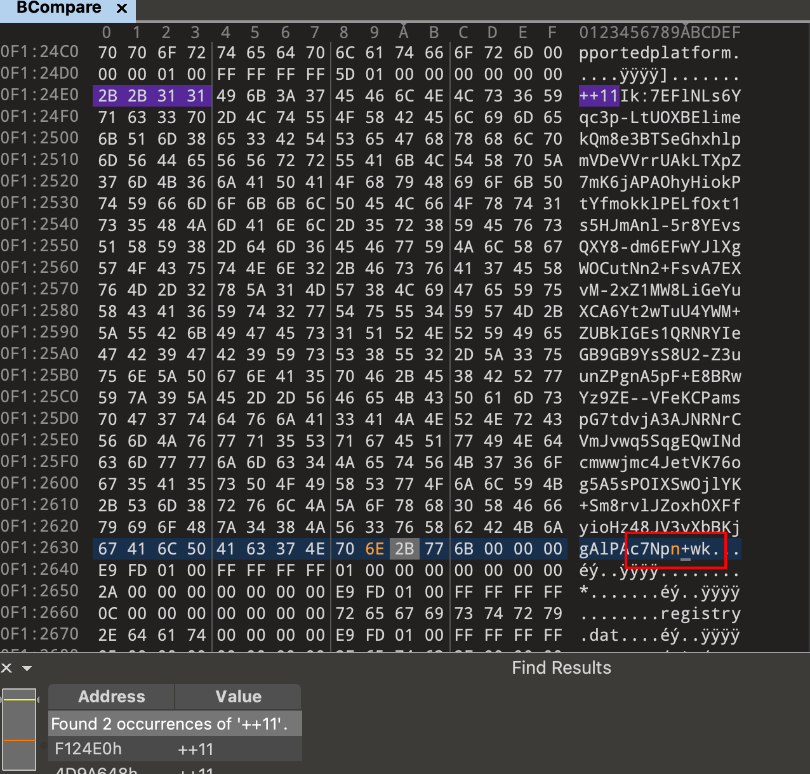
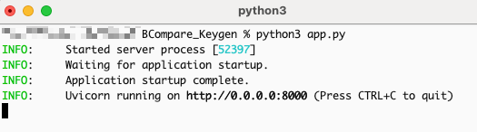
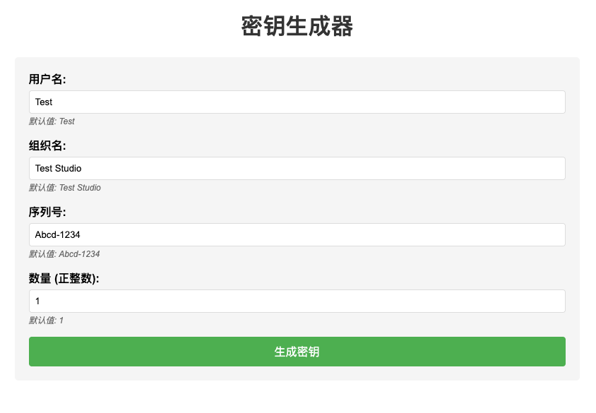
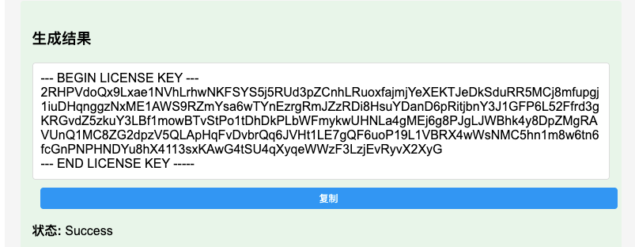
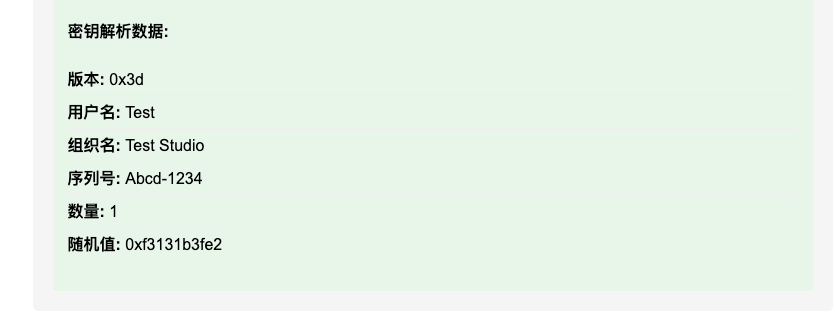
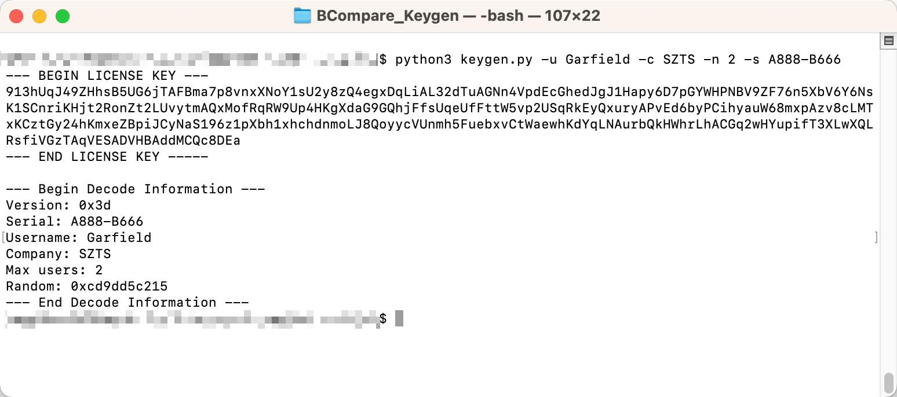
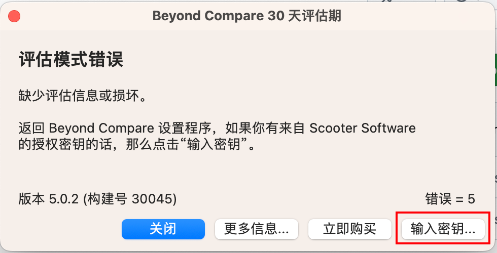
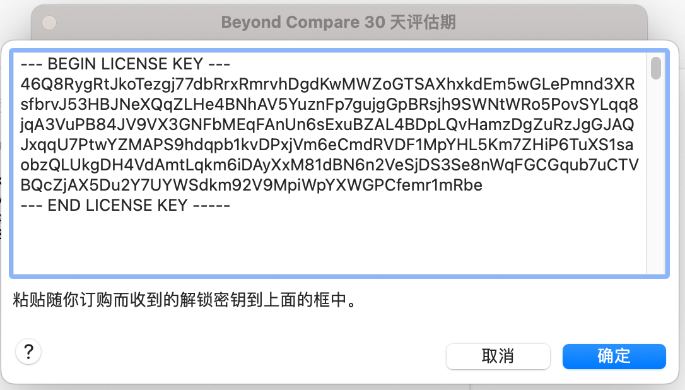
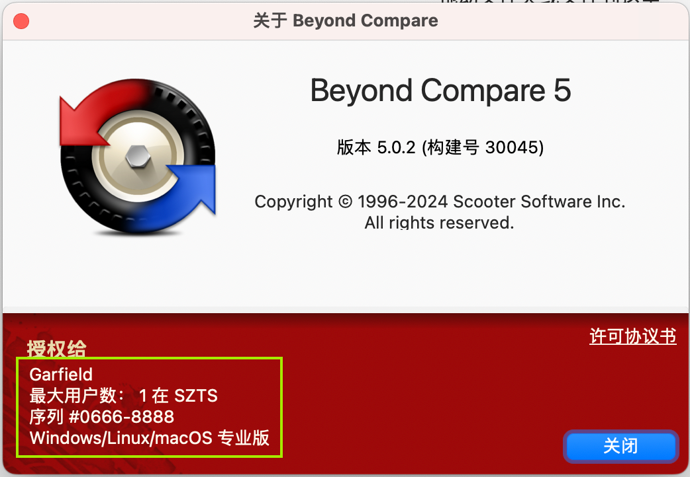
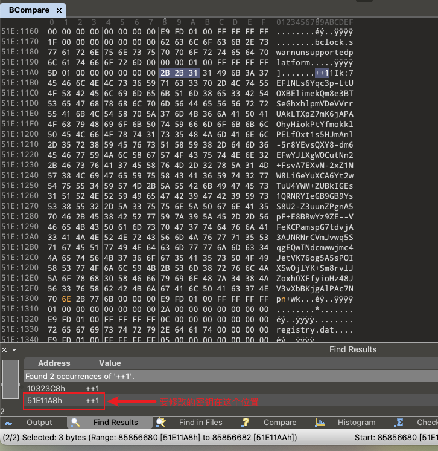

# Beyond Compare 5 Keygen

Python 3 实现的 Beyond Compare 5.x 注册密钥生成器。已在 **macOS 5.1.7 build 31736** 上验证通过。

## 工作原理

Beyond Compare 用 RSA 校验注册密钥,可执行文件里嵌了官方公钥。本仓库提前算出了和该公钥配对的私钥指数 `D`(`const.py:HEX_D`)—— 所以只要把你机器上 BCompare 二进制里的官方公钥**最末 5 个字符** `p1+wk` 改成 `pn+wk`(对应 modulus 末位差异),本地用 `D` 签出来的 license 就能通过校验。

整个流程:

| 步骤 | 做什么 | 怎么做 |
|---|---|---|
| 1 | Patch BCompare 二进制 | macOS 用 [`patch_macos.py`](#macos),Windows 用 010Editor |
| 2 | 生成 license key | 跑本仓库的 [`app.py`](#web-ui) 或 [`keygen.py`](#命令行) |
| 3 | 在 BCompare 注册框里粘贴 | 见 [使用密钥注册](#3-使用密钥注册) |

## 1. Patch BCompare 二进制

### macOS

一行命令搞定 patch + ad-hoc 重签:

```shell
git clone https://github.com/garfield-ts/BCompare_Keygen.git
cd BCompare_Keygen
python3 patch_macos.py
```

脚本会:
1. 把 `/Applications/Beyond Compare.app` 拷贝到 `~/Desktop/`(避开 App Management 限制)
2. 替换 `p1+wk` → `pn+wk`(自动覆盖 x86_64 和 arm64 两个 slice)
3. 清理 `com.apple.FinderInfo` 后 ad-hoc 重签

完成后**手动两步**(脚本无法绕过的 GUI 操作):

1. **用 Finder 把桌面那份拖回 `/Applications`,选「替换」**(Finder 自带 App Management 权限,会弹密码框授权)
2. **首次启动右键 → 打开**,Gatekeeper 弹窗里点「打开」(因为 ad-hoc 签名 = 未知开发者;也可以在 `系统设置 → 隐私与安全性` 底部点「仍要打开」)

如果失败,看下面的 [macOS 深度说明](#macos-深度说明)。

### Windows

用 010Editor 等十六进制工具打开 `BCompare.exe`,搜索字符串 `p1+wk`,改成 `pn+wk`(只有 1 处)。

```
修改前: ...HZ48JV3vXbBKjgAlPAc7Np1+wk
修改后: ...HZ48JV3vXbBKjgAlPAc7Npn+wk
```



## 2. 生成 license key

```shell
pip3 install -r requirements.txt
# Python 3.7 及以下还需要: pip3 install typing_extensions==4.7.1
```

> macOS 上 Homebrew Python 受 PEP-668 保护,装在 venv 里更稳:
> `python3.13 -m venv .venv && .venv/bin/pip install -r requirements.txt`
> (Python 3.14 太新,pydantic-core 编译失败,降到 3.13 即可)

### Web UI

```shell
python3 app.py
```

启动后访问 <http://localhost:8000/>。



页面由 AI 生成,填好用户名 / 组织名 / 序列号 / 数量后点「生成密钥」:



点「复制」按钮把密钥复制到剪贴板:



页面底部展示密钥的解析参数,方便研究学习:



### 命令行

```shell
python3 keygen.py
```

输出:

```
--- BEGIN LICENSE KEY ---
7uo7UY8gVANuMyCkDtSZRnNBkDXr1o4msYwtu7GFPaZ9B6naWXfsqEBgD5hM8jm3...
--- END LICENSE KEY -----
```

默认参数:

| 字段 | 默认值 | 说明 |
|---|---|---|
| Version | `0x3d` | `WINDOWS\|LINUX\|MACOS\|PRO`,即全平台 Pro |
| Serial | `Abcd-Efgh` | 必须匹配 `^[A-Za-z0-9]{4}-[A-Za-z0-9]{4}$` |
| Username | `Test` | 自定义用户名 |
| Company | `Home` | 自定义组织名 |
| Max users | `1` | 授权用户数 |

通过 `-u` / `-c` / `-s` / `-n` 自定义:



## 3. 使用密钥注册

打开 Beyond Compare 5,弹「评估模式错误」时点「输入密钥」:



把 keygen 输出的整段(包含 `--- BEGIN/END ---` 标记行)粘进去,点「确定」:



激活成功:



---

## macOS 深度说明

如果 `patch_macos.py` 顺利跑通就不必读这段。下面是手动 patch 时会踩到的坑,以及脚本背后做的事。

### Universal Binary:不是 1 处也不是 2 处密钥,是「每个架构 slice 各 1 处」

`/Applications/Beyond Compare.app/Contents/MacOS/BCompare` 现在是 **Universal Binary**(x86_64 + arm64),整个文件能 grep 到两处 `p1+wk` —— **这两处不是同一份密钥重复出现**,而是两个架构 slice 各持有 1 份独立的公钥。

| 位置 | 所属 slice | 谁会用到 |
|---|---|---|
| 第一处(地址较小) | x86_64 | Intel Mac |
| 第二处(地址较大) | arm64 | Apple Silicon |

旧文档「修改第二处」的指引仅在 Intel 单架构时代成立。在当前 universal binary 上:
- **Intel Mac** 跑 x86_64 → 必须改第一处
- **Apple Silicon** 跑 arm64 → 必须改第二处
- 最稳的是**两处都改**(`patch_macos.py` 就是这样做的)



### 必须 ad-hoc 重签名

修改字节后代码签名失效:Apple Silicon 直接被 AMFI 拒绝执行;Intel 上若之前点过「仍要打开」可能跑起来,但那次授权是绑定**修改前**的代码 hash,改完 slice 后会立刻失效。统一处理:

```bash
# 必须显式删这三处的 FinderInfo,否则 codesign 报 "detritus not allowed"
# (xattr -cr 不会进入 .appex 和 .framework,会静默失败)
xattr -d com.apple.FinderInfo "/path/to/Beyond Compare.app"
xattr -d com.apple.FinderInfo "/path/to/Beyond Compare.app/Contents/PlugIns/BCFinder.appex"
xattr -d com.apple.FinderInfo "/path/to/Beyond Compare.app/Contents/Frameworks/LetsMove.framework"
codesign --force --deep --sign - "/path/to/Beyond Compare.app"
codesign -v "/path/to/Beyond Compare.app"   # 应输出无错误
```

### App Management 拦终端写 `/Applications`

macOS Ventura+ 默认不允许终端进程修改 `/Applications/*.app`,会报 `Operation not permitted` —— 即使文件是你本人持有也没用。绕过:

- **方案 A(推荐)**:在 `~/Desktop` 等目录上完成 patch + 重签,再用 Finder 拖回 `/Applications`。Finder 自带 App Management 权限,会弹密码框授权。
- **方案 B**:`系统设置 → 隐私与安全性 → App 管理` 把你的终端(Terminal / iTerm / VS Code 等)加进去并打开。

### SIP 不一定要关

老文档说必须关闭 [SIP](https://sspai.com/post/55066),否则 patched 二进制启动会被「Beyond Compare 意外退出」干掉。**这条在新版 macOS(Sonoma 及以上)不再必要** —— 只要按上面 ad-hoc 重签,SIP 开着也能跑。如果遇到启动闪退,再考虑关 SIP(关 SIP 需进恢复模式执行 `csrutil disable` 后重启)。

## TODO

- Windows 版 patch 脚本自动化
- 二进制内 RSA 密钥的更稳健定位(目前 `p1+wk` → `pn+wk` 是字符串锚点,Beyond Compare 升级换公钥后会失效)
- ……
